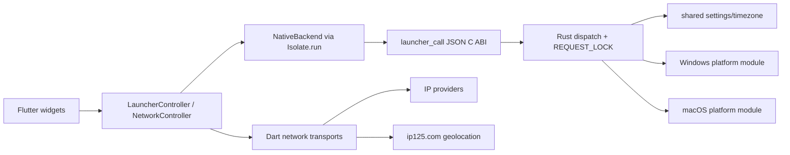

<!-- TRELLIS:START -->
# Trellis Instructions

These instructions are for AI assistants working in this project.

This project is managed by Trellis. The working knowledge you need lives under `.trellis/`:

- `.trellis/workflow.md` — development phases, when to create tasks, skill routing
- `.trellis/spec/` — package- and layer-scoped coding guidelines (read before writing code in a given layer)
- `.trellis/workspace/` — per-developer journals and session traces
- `.trellis/tasks/` — active and archived tasks (PRDs, research, jsonl context)

If a Trellis command is available on your platform (e.g. `/trellis:finish-work`, `/trellis:continue`), prefer it over manual steps. Not every platform exposes every command.

If you're using Codex or another agent-capable tool, additional project-scoped helpers may live in:
- `.agents/skills/` — reusable Trellis skills
- `.codex/agents/` — optional custom subagents

Managed by Trellis. Edits outside this block are preserved; edits inside may be overwritten by a future `trellis update`.

<!-- TRELLIS:END -->

# Repository Guidelines

## Project Overview

Codex 时区启动器 is a Windows and macOS desktop launcher built with Flutter, Forui, and a Rust native core. It starts the Codex or ChatGPT desktop client with a process-level `TZ`; it does not change the operating-system timezone. The current app version is `0.2.0`. The project is independent MIT software and is not an OpenAI product.

The app:

- Discovers or accepts a desktop client path.
- Saves a timezone draft.
- Launches the client with `TZ` set.
- Creates a desktop shortcut when requested.
- Opens Dream Skin, applies it during compatible launch, or reapplies it to a compatible running client.
- Shows local and target clocks and resolves public IP information.

The upstream `v0.2.0` migration replaced the former Vue/Tauri application under `resource/` with Flutter and Rust. Do not restore npm, Tauri, Vue, or `resource/` build instructions as current architecture.

`.trellis/spec/frontend/` and `.trellis/spec/backend/` are still init placeholders. Until they cite this repository, follow this document and the source. Trust executable code and tests over stale prose.

## Architecture & Data Flow

A Flutter desktop process owns the UI. Dart calls a versioned C ABI implemented by the Rust native core. Network lookup remains a separate Dart path and does not pass through the settings backend.



### Flutter layer

- `flutter_app/lib/main.dart` initializes timezone data and window material, then starts `LauncherApplication`.
- `LauncherApplication` selects `PreviewBackend` for preview mode or `NativeBackend` for normal mode.
- `LauncherController` owns launcher draft state and calls the backend through `LauncherBackend.call`.
- `NetworkController` independently owns public network state and cache.
- Appearance is a separate `ValueNotifier` persisted through `shared_preferences` under `flutter-appearance`.
- Network cache uses `flutter-network-v1`; it is independent of settings and appearance.

### Native boundary

`flutter_app/lib/services/backend.dart` is the only Dart-to-native settings boundary. It:

1. Serializes `{version, command, payload}` as JSON.
2. Calls `_invoke` through `Isolate.run` so blocking native work does not block Flutter UI.
3. Loads `codex_timezone_core.dll` or `libcodex_timezone_core.dylib`.
4. Verifies native ABI version `1`.
5. Calls `launcher_call` and releases both request and response memory correctly.

`native/launcher_core/src/lib.rs` owns the public FFI command gate and response envelope. Public commands are:

- `bootstrap`
- `discover`
- `validate`
- `save`
- `launch`
- `create_shortcut`
- `launch_dream_skin`
- `reapply_dream_skin`
- Windows-only `proxy_for_url`, handled before the global lock

Unknown commands fail before platform initialization. `proxy_for_url` may block on PAC/WPAD and intentionally does not hold `REQUEST_LOCK`. All other accepted commands are serialized by the process-wide mutex.

The platform modules still contain compatibility match arms such as `launch_dream_skin_app`, but the FFI whitelist makes them unreachable from the Flutter app. Do not expose them through the ABI without an explicit contract change.

### Network paths

Do not merge these paths:

- `NetworkController` fetches domestic and international IPs, then queries `https://ip125.com/api/geo/{ip}`. Results can be cached but only update the UI draft when the user chooses a detected timezone.
- On Windows, `SystemProxyResolver` calls native `proxy_for_url` for each destination and configures `HttpClient.findProxy`.
- On macOS, `MacNetworkTransport` uses the `codex_timezone/network` method channel implemented by the runner.
- `common::network_info()` shells out to curl and `ipinfo.io`. It is not a public Flutter command and the current UI does not call it.

## Launcher and Persistence Rules

- `LauncherSettings` JSON fields are `mode`, `zoneId`, `offset`, `executable`, and `dreamSkinCompatible`.
- Rust `Settings` uses camelCase serialization, `#[serde(default)]`, and PascalCase aliases for legacy files. Keep the aliases.
- Send the full settings object for save and launch. An omitted field becomes its default and can erase a stored path or compatibility flag.
- `common::load()` accepts a UTF-8 BOM. `common::save()` validates with `tz()` and atomically replaces `settings.json` through `tempfile`.
- Windows settings live in `data/settings.json` beside the executable. Bootstrap migrates the legacy `%LocalAppData%/ChatGPTTimeZoneLauncher/settings.json` only when the new file is absent.
- macOS settings live in `~/Library/Application Support/com.fei-away.codextimezone/settings.json`.
- The UI never writes `settings.json` directly.
- Preview mode is enabled by `--preview` or `--dart-define=UI_PREVIEW=true`. It must not save settings, launch clients, invoke native system operations, or access real network data.
- Do not mutate `LauncherSettings` in place. Create a new value with `copyWith` and pass it to `LauncherController.update`.

## Timezone Rules

- `native/launcher_core/src/platform/zones.json` is the allowed IANA catalog and is embedded with `include_str!`.
- Add a zone there before the UI or native backend can persist it. Keep fractional zones such as `Asia/Kathmandu` in zone mode.
- Offset mode accepts whole hours from `-12` through `14`.
- POSIX `Etc/GMT` sign inversion is intentional: `+8` becomes `Etc/GMT-8`; `-5` becomes `Etc/GMT+5`; zero becomes `Etc/UTC`.
- A public-IP response can contain an IANA id that is absent from `zones.json`. The UI may display or draft it, but save and launch must continue to reject it.
- `bootstrap` returns `localZone: "UTC"` as a stable backend placeholder. The Flutter clock code uses the local Dart timezone.

## Client and Dream Skin Rules

- Windows validation accepts only `Codex.exe` or `ChatGPT.exe` with a sibling `icudtl.dat`. The stored path is the executable, not its directory.
- macOS validation requires the `.app` bundle identifier `com.openai.codex`. The Dart file selector returns the application bundle path.
- Compatible launch binds a loopback debugger port, drops the listener, starts the client with the selected timezone, and passes the platform-specific debugging flags.
- Windows Dream Skin lives under `%LocalAppData%/CodexDreamSkin` and defaults to port `9335`.
- macOS Dream Skin is the external `Codex Dream Skin.app`; its state file lives under `~/Library/Application Support/CodexDreamSkinStudio/state.json` and defaults to port `9341`.
- Do not unify the two platforms' ports, paths, helper names, or signing behavior.
- Reapplying a skin never restarts the client or changes its timezone. It requires a client previously launched with the compatible debugging endpoint.

## Key Directories

| Path | Purpose |
| --- | --- |
| `flutter_app/lib/app/` | Flutter application shell, page, and theme |
| `flutter_app/lib/domain/` | Settings and zone data contracts |
| `flutter_app/lib/services/` | FFI backend, desktop services, clocks, network, and window material |
| `flutter_app/lib/state/` | Launcher state controller |
| `flutter_app/test/` | Dart unit and widget tests |
| `flutter_app/windows/`, `flutter_app/macos/` | Flutter desktop runner projects |
| `native/launcher_core/` | Rust C ABI, shared logic, proxy helper, and platform modules |
| `scripts/` | Local development, test, acceptance, and packaging scripts |
| `environment/` | Gitignored caches, Cargo targets, acceptance fixtures, and release artifacts |
| `.github/workflows/flutter-desktop.yml` | Release-triggered Windows/macOS build workflow |
| `.trellis/` | Trellis workflow, tasks, specs, and workspace journals |

There is no root npm project and no supported Linux backend.

## Development Commands

Requirements:

- Flutter `3.47.5` / Dart `3.13.4` or a compatible newer Flutter stable release allowed by `pubspec.yaml`
- Rust stable
- `just`
- Windows: PowerShell 7 and Visual Studio C++ desktop tools
- macOS: full Xcode

Use `just` from the repository root:

| Command | Behavior |
| --- | --- |
| `just install` | Run `flutter pub get` through the platform script |
| `just doctor` | Show Flutter toolchain diagnostics |
| `just preview` | Run with fixed preview data and no real system actions |
| `just dev` | Build the Rust library and start the real Flutter development session |
| `just test` | Run Rust tests, `flutter analyze`, and Flutter tests |
| `just build` | Build, sign where applicable, and package the current platform |
| `just native-test` | Run the Windows isolated native acceptance test without launching real Codex |

`just --list` is the authoritative recipe summary. `just install-app` was intentionally removed with the old Tauri application; release distribution uses ZIP files in `environment/artifacts/`.

The justfile is only a dispatcher. Do not duplicate Flutter or packaging logic there. On Windows it uses `cmd.exe` plus PowerShell 7 and must not require `sh.exe`.

Direct platform entry points remain available and are used by CI:

```powershell
# Windows
.\scripts\flutter-windows.ps1 -Action doctor
.\scripts\flutter-windows.ps1 -Action test
.\scripts\flutter-windows.ps1 -Action preview
.\scripts\flutter-windows.ps1 -Action run
.\scripts\flutter-windows.ps1 -Action build
.\scripts\test-native-windows.ps1
```

```bash
# macOS
bash scripts/flutter-macos.sh doctor
bash scripts/flutter-macos.sh test
bash scripts/flutter-macos.sh preview
bash scripts/flutter-macos.sh run
bash scripts/flutter-macos.sh build
```

Windows scripts locate Flutter through `FLUTTER_ROOT` or `flutter.bat` on `PATH` and accept `-FlutterSdk`. They set Cargo output under `environment/flutter-cargo-target` and reuse `environment/cargo` when present. macOS uses the same Cargo target directory through environment variables.

Build outputs are written under `flutter_app/build/` and packaged into `environment/artifacts/`. Do not commit caches, generated runner files, local settings, logs, or archives.

## Code Conventions

### Dart and Flutter

- Use standard Dart formatting: two-space indentation, trailing commas where appropriate, and no unrelated reformatting.
- User-facing errors and status text are Chinese sentences.
- Keep `LauncherController` and `NetworkController` separate. Do not introduce a second global state library.
- Child widgets receive controllers/services and emit callbacks; system operations stay in services or the native boundary.
- Use `LauncherBackend` for tests and preview injection. Do not call `DynamicLibrary` directly from widgets.
- Keep network transport abstractions deterministic in tests; close every transport and controller.
- Do not call real clocks, network services, file selectors, clipboards, or native libraries in widget tests. Inject or fake them.

### Rust and FFI

- Rust edition is 2021. Platform errors cross the ABI as Chinese `String` messages.
- Keep the C ABI versioned and ownership-explicit. Every `launcher_call` response must be released exactly once with `launcher_free`.
- Reject unknown commands before acquiring the global request lock or touching platform state.
- Blocking platform work belongs behind the existing FFI call and global lock. Do not call `launcher_call` from the Flutter UI isolate.
- Add shared behavior tests in `common.rs`; add Windows behavior tests in `win/mod.rs`; add macOS behavior tests in `mac/mod.rs`.
- Use unique `tempfile::tempdir()` suffixes for parallel tests.

### Cross-layer contracts

- Keep Dart `LauncherSettings.toJson()` and Rust `Settings` field names aligned.
- Keep public FFI commands synchronized between `LauncherController.action`, `lib.rs`, and both platform match arms where applicable.
- Preserve camelCase JSON. PascalCase aliases exist only for legacy persisted settings.
- When a data contract changes, update Dart serialization, Rust serde, relevant tests, and documentation together.

## Versioning and Release

- The Flutter app version is in `flutter_app/pubspec.yaml`; the native crate version is in `native/launcher_core/Cargo.toml`.
- Refresh `flutter_app/pubspec.lock` through Flutter and `native/launcher_core/Cargo.lock` through Cargo. Do not hand-edit either lockfile.
- Release ZIPs are portable artifacts. Do not copy local `data/settings.json` or logs into them.
- `.github/workflows/flutter-desktop.yml` runs only when a GitHub Release is published. It is not a pull-request test workflow.
- Windows and macOS builds are separate. macOS local builds are ad-hoc signed; Developer ID signing and notarization are not configured.
- Do not rename the product, runner executable, bundle identifier, or macOS settings directory without updating platform projects and providing a settings migration.

## Testing & QA

Run the broad Flutter workflow when Flutter is available:

```text
just test
```

The script runs:

```text
cargo test --manifest-path native/launcher_core/Cargo.toml
flutter analyze
flutter test
```

Run the native crate directly when changing Rust or when Flutter is unavailable:

```powershell
cargo test --manifest-path native/launcher_core/Cargo.toml --locked
```

Run Windows isolated native acceptance only when Flutter, Rust, and the Windows toolchain are available:

```text
just native-test
```

It creates a fake Codex executable under ignored `environment/` paths and does not launch the real Codex client.

For script changes, also verify:

```powershell
just --list
just --dry-run install
just --dry-run doctor
just --dry-run preview
just --dry-run dev
just --dry-run test
just --dry-run build
$null = [scriptblock]::Create((Get-Content -Raw scripts/flutter-windows.ps1))
$null = [scriptblock]::Create((Get-Content -Raw scripts/test-native-windows.ps1))
git diff --check
```

If Bash is available, run `bash -n scripts/flutter-macos.sh`. Full macOS launch, build, signing, and archive verification must be repeated on macOS; Windows dry-run is not a substitute.

Untested or platform-sensitive paths must not be assumed safe: real client discovery and launch, file selection, clipboard integration, public network transports, PAC/WPAD proxy resolution, Dream Skin helpers, FFI packaging, and macOS signing.

## Important Files

| File | Why it matters |
| --- | --- |
| `justfile` | Stable cross-platform command dispatcher; contains no build logic |
| `scripts/flutter-windows.ps1` | Windows dependency, test, run, build, and archive behavior |
| `scripts/flutter-macos.sh` | macOS dependency, test, run, sign, build, and archive behavior |
| `scripts/test-native-windows.ps1` | Isolated Windows native acceptance without a real client |
| `flutter_app/lib/main.dart` | Preview selection and application bootstrap |
| `flutter_app/lib/app/application.dart` | Backend, controller, appearance, and theme composition |
| `flutter_app/lib/app/launcher_page.dart` | Main launcher UI and user interactions |
| `flutter_app/lib/domain/settings.dart` | Dart settings JSON contract |
| `flutter_app/lib/services/backend.dart` | Dart FFI transport and preview backend |
| `flutter_app/lib/services/network_info.dart` | IP providers, ip125 lookup, and cache |
| `flutter_app/lib/services/network_transport.dart` | Windows proxy and macOS method-channel transports |
| `flutter_app/lib/state/launcher_controller.dart` | Draft, saved state, command gating, and status |
| `native/launcher_core/src/lib.rs` | ABI version, command gate, lock, and JSON envelope |
| `native/launcher_core/src/platform/common.rs` | Settings, timezone conversion, persistence, and shared helpers |
| `native/launcher_core/src/platform/win/mod.rs` | Windows discovery, validation, launch, shortcuts, and Dream Skin |
| `native/launcher_core/src/platform/mac/mod.rs` | macOS discovery, validation, launch, shortcuts, and Dream Skin |
| `native/launcher_core/src/platform/zones.json` | Allowed IANA timezone catalog |
| `.github/workflows/flutter-desktop.yml` | Release build and artifact upload contract |
