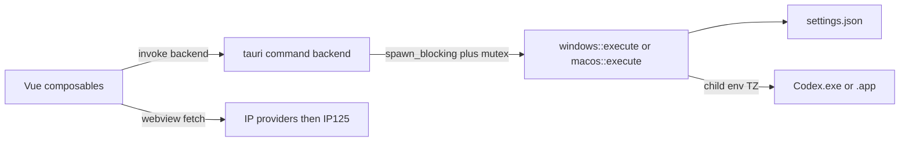

<!-- TRELLIS:START -->
# Trellis Instructions

These instructions are for AI assistants working in this project.

This project is managed by Trellis. The working knowledge you need lives under `.trellis/`:

- `.trellis/workflow.md` — development phases, when to create tasks, skill routing
- `.trellis/spec/` — package- and layer-scoped coding guidelines (read before writing code in a given layer)
- `.trellis/workspace/` — per-developer journals and session traces
- `.trellis/tasks/` — active and archived tasks (PRDs, research, jsonl context)

If a Trellis command is available on your platform (e.g. `/trellis:finish-work`, `/trellis:continue`), prefer it over manual steps. Not every platform exposes every command.

If you're using Codex or another agent-capable tool, additional project-scoped helpers may live in:
- `.agents/skills/` — reusable Trellis skills
- `.codex/agents/` — optional custom subagents

Managed by Trellis. Edits outside this block are preserved; edits inside may be overwritten by a future `trellis update`.

<!-- TRELLIS:END -->

# Repository Guidelines

## Project Overview

Codex 时区启动器 is a Windows and macOS desktop launcher. It starts the Codex or ChatGPT desktop client with a process-level `TZ`. It does not change the operating-system timezone. The current app version is `0.1.2`. The project is independent MIT software. It is not an OpenAI product.

The app does four jobs:

- It finds or accepts a desktop client path.
- It saves a timezone draft.
- It launches that client with `TZ` set.
- It can open Codex Dream Skin. When compatibility is enabled, launch attaches a local debugging port before skin apply.

Trust code over `README.md` when they disagree. Known mismatches are listed under Code Conventions.

`.trellis/spec/frontend/` and `.trellis/spec/backend/` are still init placeholders. Until those files cite this repository, follow this document and the source. Do not add Pinia, an ORM, or a second IPC command to match the templates.

## Architecture & Data Flow

One Tauri 2 process hosts a Vue 3 webview and a platform Rust backend. There is one IPC command. There is no separate service, no router, and no Linux backend.



`resource/src-tauri/src/main.rs` calls `codextimezonerev_lib::run()`. `resource/src-tauri/src/lib.rs` registers the clipboard, dialog, and opener plugins and one handler:

```rust
async fn backend(app: AppHandle, command: String, payload: Option<Value>) -> Result<Value, String>
```

The handler takes a process-wide `Mutex`, then runs platform code on `spawn_blocking`. The frontend calls it only through `invoke('backend', { command, payload })` in `resource/src/composables/useLauncher.ts`. No child component calls `invoke`.

Platform code is not a Cargo workspace member. `lib.rs` includes it with `#[path]`:

- `resource/backend/common.rs` on every target
- `resource/backend/win/mod.rs` when `cfg(windows)`
- `resource/backend/mac/mod.rs` when `cfg(target_os = "macos")`

Both `execute()` functions accept the same command strings: `bootstrap`, `discover`, `validate`, `save`, `launch`, `create_shortcut`, `launch_dream_skin`, `launch_dream_skin_app`, and `network_info`. An unknown string returns `未知命令：{command}`. Add a command to both match arms, or the other OS fails closed. The UI calls `bootstrap`, `validate`, `save`, `launch`, `create_shortcut`, and `launch_dream_skin`. `discover`, `launch_dream_skin_app`, and `network_info` have no UI caller. There is no Linux `cfg` arm. `call_backend_sync` does not compile on Linux.

Primary launch flow:

1. `App.vue` mounts `useLauncher()`, which calls `bootstrap` unless `?ui-preview=1` is set in a dev build.
2. `bootstrap` loads settings, embeds `zones.json`, discovers a client, and returns `platform` plus `settingsPath`. `localZone` in that payload is the string `UTC`.
3. The UI keeps a draft `Settings` ref. `savedSettings` is a JSON snapshot. `dirty` compares those strings.
4. Save and launch send the full settings object. Shortcut and skin-open also send it, but those commands ignore `settings`.
5. `tz()` accepts `mode: "zone"` only when `zoneId` is in `zones.json`. It accepts `mode: "offset"` only for integers `-12` through `14`.
6. Launch refuses when that client is already running. That refusal does not write `settings.json`. Launch does not kill the process.
7. After the running-client check, launch writes `settings.json`, then spawns the client with `TZ` set and `ELECTRON_RUN_AS_NODE` removed. A later spawn, early-exit, or skin failure leaves the new file on disk. The UI updates `savedSettings` only when the invoke succeeds.
8. Dream Skin compatibility binds `127.0.0.1:port`, drops that listener, then passes `--remote-debugging-address=127.0.0.1` and `--remote-debugging-port`. Skin helper processes remove `TZ`. Windows also passes `--user-data-dir`. macOS does not. Do not add or remove that flag without changing the external script contract.

`windowsId` is catalog metadata for the UI type `Zone`. Launch does not apply a Windows timezone ID. The child timezone is the IANA id, or an `Etc/GMT` value.

POSIX sign inversion is required. Offset `+8` becomes `Etc/GMT-8`. Offset `-5` becomes `Etc/GMT+5`. Offset `0` becomes `Etc/UTC`. Do not correct that sign.

Two network paths exist. Do not merge them.

- The panel uses `useNetworkInfo()`. The webview fetches domestic and international IP providers, then `https://ip125.com/api/geo/{ip}`. Results can be cached in `localStorage` key `codex-timezone-network-v1`. The button label is `使用此时区`. That action updates the draft only.
- Rust `network_info()` shells out to `curl` and `https://ipinfo.io/json`. It returns `proxy` and `direct`. The Vue UI does not call this command.

Appearance is separate from `settings.json`. `useAppearance()` stores `system`, `light`, or `dark` in `localStorage` key `codex-appearance`.

## Key Directories

| Path | Purpose |
| --- | --- |
| `resource/src/` | Vue 3 UI. `App.vue` composes the screen. `composables/` owns state. `components/` renders it. `styles/` is plain CSS. |
| `resource/backend/` | Shared timezone logic plus `win/` and `mac/` platform backends. `zones.json` is the allowed IANA catalog. |
| `resource/src-tauri/` | Tauri shell, capabilities, icons, and the Cargo package `codextimezonerev`. |
| `resource/backend/win/` | Windows backend plus dev-only `desktop.ps1` and `Initialize-DevelopmentEnvironment.ps1`. Those scripts are not the Dream Skin runtime. |
| `.github/workflows/` | Desktop release builds. The workflow does not run tests. |
| `environment/` | Local npm and Cargo cache created by `desktop.mjs`. Gitignored. Do not commit it. |
| `docs/` | Gitignored local notes. Absence in git is intentional. |

There is no root `package.json`. Run npm commands in `resource/`, or use `just` from the repository root.

## Development Commands

Requirements: Node.js `>=22.12.0`, npm `>=10`, and Rust stable. Windows also needs Visual Studio 2022 Build Tools with the Desktop development with C++ workload, plus WebView2. The initializer accepts only `VsDevCmd.bat` under `CODEX_TZ_DEV_ROOT\VisualStudioBuildTools` or `%ProgramFiles(x86)%\Microsoft Visual Studio\2022\BuildTools`. macOS needs Xcode Command Line Tools. CI uses Node 24. There is no `rust-toolchain` file and no Python toolchain. `engines` is not `engine-strict`.

From the repository root, use `just`. It only wraps the npm scripts. It does not call Tauri or Cargo directly, and CI does not use it:

```text
just install
just dev
just build
just install-app
```

`just install` runs `npm ci --cache ../environment/npm-cache` in `resource/`. `just dev` and `just build` select `dev:win` / `dev:mac` or `build:win` / `build:mac` from the host OS. `just install-app` copies the already built repo-root artifact for the current user. It does not build, and it does not load the VS environment. Windows copies `CodexTimeZoneLauncher.exe` to `%LocalAppData%\Programs\CodexTimeZoneLauncher\` and writes Start Menu shortcut `Codex 时区启动器.lnk`. macOS replaces `~/Applications/Codex 时区启动器.app`. It does not copy `data/settings.json`. Linux prints `仅支持 Windows 与 macOS。` and exits 1. The underlying commands, from `resource/`, remain:

```powershell
cd resource
npm ci --cache ../environment/npm-cache
npm run dev:win
npm run build:win
npm run start:win
npm run install:win
```

What those scripts do:

- `dev:*` and `build:*` call `node desktop.mjs`. On Windows, that script first runs `backend/win/desktop.ps1`, which loads the VS environment and re-enters with `--configured`.
- CI calls `node desktop.mjs build win --configured` because the runner already has the toolchain. Use `--configured` locally only when that environment is already loaded. Do not copy the CI command onto a machine that still needs `desktop.ps1`.
- `build:frontend` runs `vue-tsc --noEmit && vite build`. Tauri calls it before packaging. A frontend-only build has no native backend. Port `1420` must be free for `dev:*` because Vite sets `strictPort`.
- `start:*` opens the repo-root artifact. It fails until the matching build exists. `start` does not load the VS environment. `just` does not wrap `start`.
- `install:*` installs that artifact for the current user. It fails until the matching build exists. It does not load the VS environment. `just install-app` wraps it.
- `npm run tauri` bypasses `desktop.mjs`. It skips the OS check, cache redirect, icon override, `--locked`, and artifact copy. `tauri.conf.json` sets `bundle.targets` to `all`. `desktop.mjs` forces macOS `--bundles app` and Windows `--no-bundle`. Do not use `npm run tauri` for a release build.

`desktop.mjs` writes artifacts to the repository root:

- Windows: `CodexTimeZoneLauncher.exe`, copied from `codextimezonerev.exe`
- macOS: `Codex 时区启动器.app`

Those paths are gitignored. The macOS bundle folder name is hardcoded in `desktop.mjs`. A `productName` change that does not update those paths breaks publish. macOS replaces the `.app` as a whole. If `APPLE_SIGNING_IDENTITY` is unset, the script ad-hoc signs with `codesign --sign -`. If that variable is set, the script does not sign with it. It only verifies. CI does not notarize.

Optional environment variables:

- `CODEX_TZ_DEV_ROOT`: Windows toolchain root. Expected children are `NodeJS`, `Git\cmd`, `Rust\rustup`, `Rust\cargo`, and `VisualStudioBuildTools\Common7\Tools\VsDevCmd.bat`. `desktop.mjs` still overwrites `CARGO_HOME` to `environment/cargo`. This variable does not keep the Cargo registry in the dev root.
- `CODEX_TZ_PROXY`: copied to `HTTP_PROXY` and `HTTPS_PROXY`. The PowerShell initializer also sets `CARGO_HTTP_PROXY`.
- `CARGO_BUILD_TARGET`: must be unset. The script rejects it.
- `TAURI_DEV_HOST`: Vite uses port `1420` and HMR port `1421`. Do not change the port without `tauri.conf.json`.

There is no lint script, format script, or `npm test` script. Frontend typecheck is the `vue-tsc --noEmit` step inside `build:frontend`.

## Code Conventions & Common Patterns

Naming:

- Vue components are PascalCase files with `<script setup lang="ts">`.
- Composables are `useX.ts` and return refs. There is no Pinia, Vuex, `provide`/`inject`, or dependency-injection container.
- Rust command strings are `snake_case`. Settings fields are `camelCase` in JSON and TypeScript.
- User-facing errors and status text are Chinese sentences. Keep that language when you add a user-visible failure.
- Backend functions return `Result<T, String>`. The webview shows `String(error)` as message detail.
- Frontend TypeScript uses 2-space indent, single quotes, and no semicolons. Match the file you edit. Rust in `common.rs` and `win/mod.rs` is dense. `mac/mod.rs` is expanded.

State:

- Draft settings live in a Vue `ref`. Do not write `settings.json` from the webview.
- `useLauncher()` returns a plain object of refs, not `reactive()`. `App.vue` reads `launcher.settings.value`. Nested refs do not auto-unwrap. Do not switch the template to `launcher.settings` unless you also make the return value reactive.
- Child components emit patches. The parent writes `{ ...settings, ...patch }`. Do not mutate settings fields in place.
- Block save and launch while `initializing` or `bootstrapFailed` is set. Preview mode (`import.meta.env.DEV` and `?ui-preview=1`) must not call native dialogs, save, launch, or shortcuts. Related query keys are `ui-mode`, `ui-path`, `ui-theme`, `ui-menu`, and `ui-network`. A production build ignores that short-circuit and still calls `invoke`.
- One mutex serializes every `backend` call, including Dream Skin waits of 45 seconds plus up to 150 seconds on macOS or 330 seconds on Windows. Do not add a command that waits on another `backend` call.

Persistence:

- JSON field names are `mode`, `zoneId`, `offset`, `executable`, and `dreamSkinCompatible`.
- `Settings` uses `#[serde(default)]` and PascalCase aliases such as `Mode` and `ZoneId`. Keep the aliases. Send the full object. An omitted field becomes the default and can wipe `executable` or the skin flag.
- `load()` strips a UTF-8 BOM. `save()` validates with `tz()`, then atomically replaces `settings.json` through `tempfile`. A rejected save must leave the previous file intact.
- Windows settings live in `data/settings.json` beside the executable. Dev and installed builds do not share that directory. Migration runs only in `bootstrap`, and only when the new file is absent. The only legacy source is `%LocalAppData%/ChatGPTTimeZoneLauncher/settings.json`.
- macOS settings live in `~/Library/Application Support/com.fei-away.codextimezone/settings.json`. There is no legacy migration.
- `bootstrap` returns `localZone: "UTC"`. The UI replaces it with `Intl.DateTimeFormat().resolvedOptions().timeZone`. Do not treat the backend value as the machine zone.

Timezone rules:

- A new IANA zone needs a `zones.json` object with `label`, `id`, and `windowsId`. `tz()` rejects ids that are absent from that file. Keep `Asia/Kathmandu`. The macOS persistence test saves it.
- `isValidTimeZone()` uses `Intl`. `使用此时区` can therefore put an IP125 id into the draft that `save` or `launch` rejects. Do not widen `tz()` to arbitrary strings.
- Offset mode is whole hours only. The UI labels are `地区时区` and `固定 UTC 偏移`. Fractional zones such as `Asia/Kathmandu` belong in `地区时区`, not in `offset`.
- A running-client refusal does not write settings. A failure after the atomic save does write them.

Client identity:

- Windows `validate` accepts only `Codex.exe` or `ChatGPT.exe` with a sibling `icudtl.dat`. The stored path is that `.exe`. Discovery prefers the newest MSIX package `OpenAI.Codex`, then `%LocalAppData%\Programs\Codex\Codex.exe`, `Codex\Codex.exe`, and `Programs\OpenAI\Codex\Codex.exe`.
- macOS `validate` requires bundle id `com.openai.codex`. The IPC `path` is the `.app`, not the inner binary. Discovery checks `/Applications` and `~/Applications`, then `mdfind`. Shortcut creation requires a built `.app` ancestor and does not overwrite a different existing desktop entry. A dev binary fails with `开发模式不支持创建快捷方式，请使用构建后的 .app。`.
- Dream Skin is external. Windows looks in `%LocalAppData%/CodexDreamSkin`, requires `tray-dream-skin.ps1`, `common-windows.ps1`, `theme-windows.ps1`, `localization-windows.ps1`, and `start-dream-skin.ps1`, and defaults to port `9335`. macOS looks for `Codex Dream Skin.app` and `Contents/Resources/engine/scripts/start-dream-skin-macos.sh`, and defaults to port `9341` from `CodexDreamSkinStudio/state.json`. Do not unify those ports or script names. `enable_skin` in `mac/mod.rs` has no caller. Do not treat it as a command.

Frontend boundaries:

- MacVue components come from `@macvue/core` `0.1.0`. Menu portals are `#appearance-menu-root`, `#timezone-menu-root`, and `#offset-menu-root`. `AppSelect.vue` stops viewport scroll and locks `.workspace-scroll` while a menu is open. Keep that lock.
- Component files have no `<style>` blocks. Put visual changes in `resource/src/styles/`.
- Imports are relative. `tsconfig.json` has no `paths` map. `strict`, `noUnusedLocals`, and `noUnusedParameters` are on. npm dependency versions are exact. Do not introduce `^` ranges.
- A new webview network host must be added to `connect-src` in `resource/src-tauri/tauri.conf.json`. `curl` hosts do not need a CSP entry. `ipinfo.io` is a curl host. `ip125.com` is a webview host.
- A new Tauri plugin permission belongs in `resource/src-tauri/capabilities/default.json`. Current grants are `core:default`, clipboard read/write, `opener:default`, and `dialog:allow-open`. The opener plugin is initialized, but `resource/src` does not import it. Clipboard copy writes text and then reads it back.

README mismatches to ignore when editing code:

- The apply-timezone control is `使用此时区`, not `应用识别时区`. The launch button is `保存并启动 Codex`. The skin button is `打开 Dream Skin`. There is no `应用设置` label.
- The configured window is `1280×900`, minimum `760×640`. CSS reflow is at `999px`, `759px`, and `520px`. The README sizes `760×900` and `600×800` are not packaged window sizes.
- The panel does not query proxy and direct exits. That behavior belongs only to unused-by-UI `network_info()`.
- README offset text is `UTC−12:00` to `UTC+14:00`. The implementation is integer hours, with POSIX `Etc/GMT` sign inversion.

## Important Files

| File | Why it matters |
| --- | --- |
| `resource/desktop.mjs` | Cross-platform dev, build, and start dispatcher. Owns artifact paths and Cargo cache env. |
| `resource/backend/win/desktop.ps1` | Windows entry that loads VS tools, then re-enters `desktop.mjs --configured`. |
| `resource/src-tauri/src/lib.rs` | The only IPC boundary and the platform include switch. |
| `resource/backend/common.rs` | `Settings`, `tz()`, atomic load/save, and shared Dream Skin probe helpers. |
| `resource/backend/zones.json` | Compile-time catalog via `include_str!`. Invalid JSON fails at `zones()`, not as a type error. |
| `resource/backend/win/mod.rs` | Windows discovery, validation, launch, shortcut, and Dream Skin. |
| `resource/backend/mac/mod.rs` | macOS discovery, validation, launch, symlink shortcut, and Dream Skin. |
| `resource/src/types.ts` | Shared UI contract. Keep it aligned with serde `camelCase`. |
| `resource/src/composables/useLauncher.ts` | Bootstrap, dirty state, and command gating. |
| `resource/src/composables/useNetworkInfo.ts` | Webview IP lookup. Independent from Rust `network_info()`. |
| `resource/src/composables/useClocks.ts` | Target and local preview. Pauses while the document is hidden. Exports `isValidTimeZone`. |
| `resource/src-tauri/tauri.conf.json` | Product name, identifier, window size, CSP, and frontend commands. |
| `resource/src-tauri/capabilities/default.json` | Plugin permissions for the `main` window. |
| `.github/workflows/build-desktop.yml` | macOS ARM64 and Windows x64 release builds. Tag `v*` publishes a GitHub Release. |

Bump `0.1.2` together in `resource/package.json`, `resource/src-tauri/Cargo.toml`, and `resource/src-tauri/tauri.conf.json`. Refresh `package-lock.json` with npm and `Cargo.lock` with Cargo. Do not hand-edit `Cargo.lock`. Nothing checks that the three manifests match. A `v*` tag uses the git tag in the release title. It does not read `0.1.2`. The identifier `com.fei-away.codextimezone` is also the macOS settings directory name. Do not rename the product, identifier, or macOS artifact folder unless you also update `desktop.mjs` and migrate stored settings.

`resource/src-tauri/gen/schemas/` is committed generated ACL output. Do not hand-edit it. It can go stale after a capability change.

## Runtime/Tooling Preferences

- Package manager is npm. The lockfile is `lockfileVersion` 3. Use `npm ci` in `resource/`. Do not add pnpm, Yarn, or Bun.
- `resource/.npmrc` sets `fund=false` and `audit=false`. There is no `packageManager` field.
- Rust edition is 2021. Release profile uses one codegen unit, `lto = true`, `panic = "abort"`, and `strip = true`. Do not expect panic backtraces from a release build.
- Windows release hides the console with `windows_subsystem` in `resource/src-tauri/src/main.rs`.
- `desktop.mjs` overwrites `CARGO_HOME` and sets `CARGO_TARGET_DIR` under `../environment`, even if the PowerShell initializer set `CARGO_HOME` from `CODEX_TZ_DEV_ROOT`. macOS uses `environment/macos/cargo` and `environment/macos/cargo-target`. Direct `cargo` commands do not use that redirect unless you export it.
- Do not commit `environment/`, `data/`, `resource/node_modules/`, `resource/dist/`, `resource/**/target/`, `.env`, the root executable, or the root `.app`.
- `.gitattributes` does not set line endings. Do not add an `eol` rule unless asked. It only sets `merge=union` for Trellis journals.
- Do not add a path alias, a second state library, or a second IPC command unless the existing `backend` string protocol cannot express the change.

## Testing & QA

Tests are Rust `#[cfg(test)]` modules inside the backend files. There are no `*.test.ts` or `*.spec.ts` files, no Vitest or Playwright config, no coverage tool, and no fixtures directory. `resource/**/coverage/` is gitignored, but nothing writes it.

There is no `npm test` and no `just test`. Run the existing tests from the Tauri package:

```powershell
cargo test --manifest-path resource/src-tauri/Cargo.toml --locked
```

On Windows this compiles `common.rs` and `win/mod.rs` only. The compiled tests are `legacy_settings_and_atomic_replace` and `debugger_endpoint_rejects_unrelated_http_service`. The Unix skin-log test and every `mac/mod.rs` test are absent. On macOS the Windows module does not build. `win/mod.rs` has no tests. macOS tests shell out to `/bin/date`, `/usr/bin/plutil`, and `/bin/sh`. They do not run on Windows. `installed_client_and_running_guard` returns immediately when `discover()` is empty, and it can touch a real running client. A pass does not prove the guard.

CI does not run `cargo test`, and it does not run on pull requests. `.github/workflows/build-desktop.yml` runs on `workflow_dispatch`, pushes to `main`, and tags `v*`. It proves that `npm run build:mac` and `node desktop.mjs build win --configured` produce artifacts. The macOS job also runs `codesign --verify`. A green workflow is not test coverage. Push to `main` uploads artifacts. Only a `v*` tag publishes a GitHub Release. CI uses `npm ci` in `resource/`, not `just`, and not the `environment/npm-cache` path.

Add a backend regression in the existing `#[cfg(test)] mod tests` of the file that owns the behavior. Use `use super::*`. Shared tests should use `tempfile::tempdir()`. Do not add `resource/src-tauri/tests/` for a private helper. Those integration tests cannot see `super`. On macOS, do not reuse the temp suffixes `settings`, `bundle`, or `guard`. Those names collide under parallel `cargo test`. Do not add a JavaScript runner for a one-off check. Frontend changes have no automated suite. Use dev preview (`npm run dev:win`, then the Vite URL with `?ui-preview=1`) for layout and copy. Use a real `dev:win` or `dev:mac` session for IPC, path validation, launch, and Dream Skin.

Untested paths you must not assume are safe: the Windows backend, macOS `execute` and skin apply, `network_info`, the Tauri command mutex, webview IP providers, CSP, clock formatting, and the dirty-state gate. `?ui-preview=1` is a manual demo hook, not a test.
